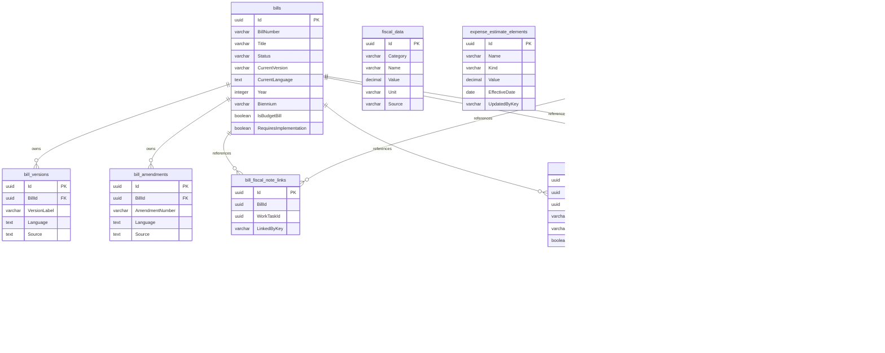
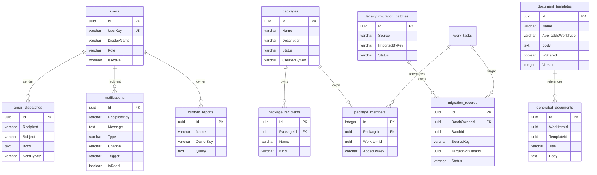

# LTS PostgreSQL Data Model Diagrams

Status: forward-looking database documentation

Last updated: 2026-09-06

## Source

These diagrams summarize the current PostgreSQL persistence model generated from:

- `docs/database/lts-postgresql-ddl.sql`
- `src/Legislature.TrackingSystem.Infrastructure/Persistence/LtsDbContext.cs`
- `src/Legislature.TrackingSystem.Infrastructure/Persistence/Migrations/`

The DDL script is an idempotent EF Core migration script for PostgreSQL. It includes the EF migration history table, current tables, primary keys, foreign keys, indexes, and migration guards.

## Physical Foreign Keys

This diagram shows relationships currently enforced by PostgreSQL foreign-key constraints.

```mermaid
erDiagram
    bills ||--o{ bill_versions : owns
    bills ||--o{ bill_amendments : owns

    packages ||--o{ package_members : owns
    packages ||--o{ package_recipients : owns

    implementation_tasks ||--o{ shared_documents : owns

    legacy_migration_batches ||--o{ migration_records : owns

    work_tasks ||--o{ executive_review_adjustments : owns
    work_tasks ||--o{ executive_reviewers : owns
    work_tasks ||--o{ work_task_assignments : owns
    work_tasks ||--o{ work_task_attachments : owns
    work_tasks ||--o{ work_task_audit_entries : owns
    work_tasks ||--o{ work_task_comments : owns
    work_tasks ||--o{ work_task_versions : owns
    work_tasks ||--o{ workflow_reviews : owns
    work_tasks ||--o{ workflow_steps : owns
```

## Core Work Product Model

This diagram shows the work task aggregate and the primary app-level references around it. Relationships marked as "references" are logical ID links in the current schema, not physical PostgreSQL foreign keys.

```mermaid
erDiagram
    work_tasks {
        uuid Id PK
        varchar Identifier UK
        varchar Type
        varchar Title
        varchar Priority
        varchar Status
        varchar WorkflowStatus
        varchar ExecutiveReviewStatus
        integer Year
        text Content
        text_array RequiredReviewerKeys
        varchar StoryId
        varchar RequirementId
        varchar RequirementType
        varchar SourceDocument
    }

    work_task_assignments {
        uuid Id PK
        uuid WorkTaskId FK
        varchar AssigneeKey
        varchar Role
        date DueDate
        boolean IsRework
        boolean IsSuperseded
    }

    workflow_reviews {
        uuid Id PK
        uuid WorkTaskId FK
        varchar ReviewerKey
        varchar Decision
        varchar Comment
    }

    workflow_steps {
        uuid Id PK
        uuid WorkTaskId FK
        varchar Name
        date DueDate
        varchar Status
    }

    executive_reviewers {
        uuid Id PK
        uuid WorkTaskId FK
        varchar ReviewerKey
        integer ReviewOrder
        varchar Status
    }

    executive_review_adjustments {
        uuid Id PK
        uuid WorkTaskId FK
        varchar ReviewerKey
        varchar Note
    }

    work_task_attachments {
        uuid Id PK
        uuid WorkTaskId FK
        varchar FileName
        varchar ContentType
        bigint SizeBytes
    }

    work_task_comments {
        uuid Id PK
        uuid WorkTaskId FK
        varchar AuthorKey
        text Body
    }

    work_task_audit_entries {
        uuid Id PK
        uuid WorkTaskId FK
        varchar Action
        text Detail
        varchar ByKey
    }

    work_task_versions {
        uuid Id PK
        uuid WorkTaskId FK
        integer VersionNumber
        text Content
    }

    generated_documents {
        uuid Id PK
        uuid WorkItemId
        uuid TemplateId
        varchar Title
        text Body
    }

    fiscal_work_papers {
        uuid Id PK
        uuid WorkTaskId
        varchar Title
        text Content
    }

    access_restrictions {
        uuid Id PK
        uuid WorkTaskId
        varchar DataType
        varchar RestrictedUserType
    }

    work_item_relationships {
        uuid Id PK
        uuid SourceItemId
        uuid TargetItemId
        varchar Type
    }

    work_tasks ||--o{ work_task_assignments : owns
    work_tasks ||--o{ workflow_reviews : owns
    work_tasks ||--o{ workflow_steps : owns
    work_tasks ||--o{ executive_reviewers : owns
    work_tasks ||--o{ executive_review_adjustments : owns
    work_tasks ||--o{ work_task_attachments : owns
    work_tasks ||--o{ work_task_comments : owns
    work_tasks ||--o{ work_task_audit_entries : owns
    work_tasks ||--o{ work_task_versions : owns

    work_tasks ||--o{ generated_documents : references
    work_tasks ||--o{ fiscal_work_papers : references
    work_tasks ||--o{ access_restrictions : references
    work_tasks ||--o{ work_item_relationships : source
    work_tasks ||--o{ work_item_relationships : target
```

## Legislative, Fiscal, and Executive Model

This diagram groups bill tracking, fiscal analysis, implementation, correspondence, and executive discussion tables. Several links are logical references only in the current DDL.

## Package, Template, Reporting, User, and Migration Model

This diagram covers package organization, generated document support, users, reports, notifications, productivity records, and migration batches.

## Physical Index Summary

The generated DDL includes 36 indexes. Notable unique indexes:

- `IX_users_UserKey`
- `IX_work_tasks_Identifier`
- `IX_demographic_data_Session_Category`

Frequently queried fields with non-unique indexes include:

- `bills.BillNumber`
- `work_tasks.Type`
- `work_tasks.Status`
- `work_tasks.Year`
- `notifications.RecipientKey`
- `custom_reports.OwnerKey`
- `email_dispatches.SentAt`
- `fiscal_data.Category, Name`
- `expense_estimate_elements.Name, Kind`
- child-table owner IDs such as `WorkTaskId`, `BillId`, `PackageId`, and `ImplementationTaskId`

## Modeling Notes

- Owned collections are physically represented as separate tables with cascade deletes from their aggregate root.
- `work_tasks` embeds source trace columns directly: `StoryId`, `RequirementId`, `RequirementType`, and `SourceDocument`.
- `work_tasks.RequiredReviewerKeys` is a PostgreSQL `text[]` column.
- Several application-level references are indexed but not enforced as PostgreSQL foreign keys in the current EF model, including `generated_documents.WorkItemId`, `generated_documents.TemplateId`, `correspondence.BillId`, `correspondence.WorkTaskId`, `implementation_tasks.BillId`, `bill_fiscal_note_links.BillId`, `bill_fiscal_note_links.WorkTaskId`, `package_members.WorkItemId`, `work_item_relationships.SourceItemId`, and `work_item_relationships.TargetItemId`.
